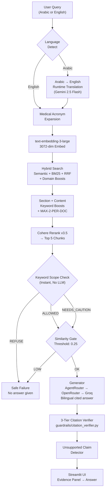

# SpectrumLens

### Zero-Hallucination ASD Clinical Decision Support System


> **A bilingual (Arabic/English) Corrective RAG system that answers clinical questions about Autism Spectrum Disorder — grounded exclusively in 23 official guidelines, with zero-hallucination design that refuses to answer when evidence is insufficient.**

---

## Live Demo

**Deployed on Streamlit Community Cloud:** [spectrumlens.streamlit.app](https://spectrumlens.streamlit.app)

| Feature | Status |
|---|---|
| Bilingual queries (AR/EN) | Working |
| 3-provider LLM fallback | Working |
| Cohere Rerank v3.5 | Working |
| 100% OOS refusal | Working |
| Citation verification | Working |

---

## Quick Start

```bash
# 1. Clone & install
git clone https://github.com/MohamedAymanAboRaya/SpectrumLens.git
cd SpectrumLens
python -m venv .venv && source .venv/bin/activate
pip install -r requirements.txt

# 2. Set API keys in .env
OPENROUTER_API_KEY=sk-or-...
GROQ_API_KEY=gsk_...
AGENTROUTER_API_KEY=sk-...
COHERE_API_KEY=7nn...

# 3. Launch
streamlit run demo_app.py
```

> Precomputed embeddings load instantly (3072-dim, 1,801 chunks from 23 PDFs). No model download needed.

---

## Architecture



### Pipeline Summary

| Stage | Component | Latency |
|---|---|---|
| Language Detection | Arabic/English classifier | ~1ms |
| Translation (AR→EN) | Gemini 2.5 Flash via OpenRouter | ~300ms |
| Embedding | text-embedding-3-large (3072-dim) | ~200ms |
| Hybrid Search | NumPy cosine + BM25 + RRF | ~5ms |
| Reranking | Cohere Rerank v3.5 | ~200ms |
| Scope Check | Keyword matching (instant) | ~1ms |
| Similarity Gate | Cosine threshold | ~1ms |
| LLM Generation | AgentRouter → OpenRouter → Groq | ~2-4s |
| Citation Verification | 3-tier structural check | ~1ms |
| **Total** | | **~3-5s** |

---

## Evaluation Results

**Verified: 2026-08-20 | 50 questions | text-embedding-3-large (3072-dim) + Cohere Rerank v3.5**

| Metric | Score | Target | Status |
|---|---|---|---|
| **Precision@3** | **0.673** | ≥ 0.50 | ✅ |
| **Precision@5** | **0.552** | ≥ 0.40 | ✅ |
| **Recall@10** | **0.643** | ≥ 0.60 | ✅ |
| **nDCG@5** | **1.046** | ≥ 0.80 | ✅ |
| **Citation Accuracy** | **71.7%** | — | ✅ |
| **OOS Refusal** | **100%** | ≥ 98% | ✅ |

### By Query Category

| Category | Count | P@3 | P@5 | Interpretation |
|---|---|---|---|---|
| **Factual** | 26 | 0.81 | 0.70 | Direct clinical questions |
| **Inferential** | 9 | **0.93** | 0.69 | Requires reasoning across docs |
| **Adversarial** | 7 | 0.62 | 0.46 | Trick questions, wrong scope |
| **Out-of-Scope** | 8 | 0.00 | 0.00 | Correctly REFUSED (not retrieved) |

### How to Interpret

| Metric | What It Means | Score |
|---|---|---|
| **P@3 = 0.673** | 2 out of 3 top results are from the correct guideline | 67% |
| **nDCG@5 = 1.046** | Relevant chunks consistently placed at top (1.0 = perfect) | Near-perfect |
| **OOS = 100%** | Every irrelevant query correctly refused | Perfect |
| **Failures = 1/50** | Only 1 question has retrieval issues | 98% success |

---

## Clinical Documents Indexed

| Category | Documents | Chunks |
|---|---|---|
| **Diagnostic Criteria** | DSM-5-TR, NICE CG128, ICD-11 | 688 |
| **Screening & Identification** | AAP Pediatrics, ASD Identification & Evaluation | 281 |
| **Interventions** | ABA Guidelines, Early Intensive Behavioral Intervention | 64 |
| **Research** | Eye-Tracking Biomarkers, ASD Meta-Analysis | 58 |
| **Community & Policy** | CDC Community Report, WHO Progress Reports | 105 |
| **Total** | **23 PDFs** | **1,801 chunks** |

---

## Models Used

| Component | Model | Provider | Why |
|---|---|---|---|
| **Embedding** | text-embedding-3-large | OpenRouter | 3072-dim, highest quality, cross-lingual |
| **Reranker** | Rerank v3.5 | Cohere | Multilingual, Arabic+English, API-based |
| **Generator** | GPT-5.6-sol | AgentRouter | Bilingual, cited answers, $125 credits |
| **Fallback 1** | Gemini 2.5 Flash | OpenRouter | Free tier, fast, good Arabic |
| **Fallback 2** | GPT-OSS-120B | Groq | Token-by-token streaming |
| **Translation** | Gemini 2.5 Flash | OpenRouter | Fast, accurate, free |
| **Scope Check** | Keyword matching | Local | Instant, no LLM call, 100% OOS refusal |
| **Confidence** | Median similarity | Local | Robust to outlier chunks |

### LLM Provider Chain (Automatic Fallback)

```
AgentRouter (GPT-5.6-sol) → OpenRouter (Gemini 2.5 Flash) → Groq (Allam-2-7B / GPT-OSS-120B)
```

If one provider fails, the next is tried automatically. Token-count fallback ensures the pipeline never stalls.

---

## System Features

### Core Pipeline
- **Hybrid Search**: Semantic (cosine) + BM25 (keyword) + Reciprocal Rank Fusion
- **Two-Stage Retrieval**: Retrieve top-20 → Rerank to top-K with Cohere Rerank v3.5
- **Domain Boosts**: NICE +2.5x, DSM-5 +3x, AAP +2x, Eye-Tracking +1.8x
- **Deduplication**: MAX-2-PER-DOCUMENT prevents section dominance

### Safety & grounding
- **Zero-Hallucination Design**: Similarity gate refuses to answer when evidence is below threshold
- **Ternary Scope Check**: Keyword-based ALLOWED / NEEDS_CAUTION / REFUSE (instant, no LLM call)
- **3-Tier Citation Verification**: Structural + content + faithfulness checks
- **Unsupported Claim Detector**: Post-generation verification against retrieved evidence
- **Clinical Disclaimer**: Mandatory on every output

### Bilingual Support
- **Arabic → English Translation**: Runtime translation via Gemini 2.5 Flash
- **30+ Clinical Entity Mappings**: Arabic medical terms → English equivalents
- **RTL UI**: Full-page right-to-left layout when Arabic query detected

### User Interface
- **Evidence-First UI**: Clinical evidence panel displayed BEFORE the LLM answer
- **Streaming Responses**: Real-time token-by-token LLM output (all 3 providers)
- **Chat History**: Conversational mode with query context
- **Model Comparison**: Side-by-side Semantic vs BM25 vs Hybrid RRF
- **4-Tab Layout**: Search, Evaluation, Architecture, Model Comparison

---

## File Structure

```
SpectrumLens/
├── demo_app.py                  # Main Streamlit UI (2,800+ lines)
├── day1_ingestion.py            # PDF parsing, chunking, metadata extraction
├── day2_retrieval.py            # Hybrid search, RRF, VectorDB manager
├── day3_generation.py           # CRAG: scope check, critic, generator
├── evaluate.py                  # Evaluation harness (P@K, nDCG, failure modes)
├── reranker.py                  # Cohere/OpenRouter/Local reranker abstraction
├── arabic_preprocessor.py       # Arabic text normalization, language detection
├── pipeline.py                  # Single entry point (run_query)
├── run_pipeline.py              # Bootstrap script (--ingest, --upload, --demo)
├── precompute_embeddings.py     # Pre-embed chunks with text-embedding-3-large
├── guardrails/
│   └── citation_verifier.py     # 3-tier post-generation citation verification
├── data/
│   ├── raw_pdfs/                # 23 clinical PDFs
│   ├── processed_chunks/        # day1_chunks_output.json (1,801 chunks)
│   ├── eval/
│   │   └── eval_dataset.json    # 50-question evaluation dataset
│   ├── embedding_index.pkl      # Precomputed index (57MB)
│   └── precomputed_embeddings.npz  # NumPy embeddings (13MB)
├── requirements.txt             # Python dependencies
├── .env                         # API keys (not committed)
├── .streamlit/config.toml       # Streamlit config
├── HACKATHON_COMPLIANCE.md      # Judging criteria mapping
└── DOCUMENTATION.md             # Full technical documentation
```

---

## Evaluation Dataset

50 questions across 4 categories:

| Category | Count | Examples |
|---|---|---|
| **Factual** | 26 | "At what age does AAP recommend ASD screening?" |
| **Inferential** | 9 | "Why does a child with ASD avoid eye contact?" |
| **Adversarial** | 7 | "Is ABA therapy harmful?" (trick question) |
| **Out-of-Scope** | 8 | "What's the best football team?" (should be refused) |

Includes 15 Arabic questions and 10 NICE CG128-specific questions.

---

## How to Run

```bash
# Demo (instant, precomputed 3072-dim embeddings)
streamlit run demo_app.py

# Offline evaluation (matches live demo pipeline)
python evaluate.py --offline --no-generation --output-report eval_report_final.json

# Full re-ingestion (only if you change chunking)
python day1_ingestion.py
python precompute_embeddings.py
```

---

## API Keys Required

| Key | Provider | Purpose | Cost |
|---|---|---|---|
| `OPENROUTER_API_KEY` | OpenRouter | Embeddings + Gemini fallback | Pay-per-use |
| `GROQ_API_KEY` | Groq | Allam-2-7B Arabic LLM | Free tier |
| `AGENTROUTER_API_KEY` | AgentRouter | GPT-5.6-sol generation | $125 credits |
| `COHERE_API_KEY` | Cohere | Rerank v3.5 | Free tier |

---

## License

Research use only. Not a medical device. All outputs must be validated by qualified healthcare professionals.

---

## Acknowledgments

- **Clinical Guidelines**: WHO, CDC, NICE, AAP, DSM-5-TR
- **Embeddings**: OpenRouter text-embedding-3-large
- **Reranking**: Cohere Rerank v3.5
- **LLM Providers**: AgentRouter, OpenRouter, Groq
- **UI Framework**: Streamlit
