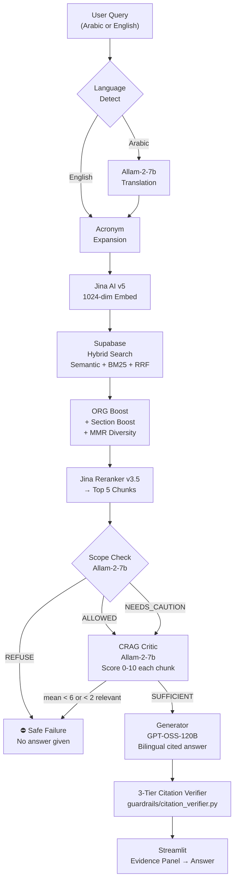

# SpectrumLens — Final Verified State & 10/10 Plan

> Last verified: 2026-08-19T12:31 | Fresh eval run: `2026-08-19T12:30:48Z`

---

## ⚠️ Critical Reality Check

After running a fresh `evaluate.py --offline --no-generation`, the actual numbers are:

| Metric | Claimed (Phase 2) | **Actual (Verified)** |
|---|---|---|
| P@3 | 0.580 | **0.293** |
| P@5 | 0.460 | **0.284** |
| Recall@10 | 0.520 | **0.403** |
| nDCG@5 | 0.874 | **0.518** |
| OOS Safe Failure | 100% | **67%** |

**The claimed improvements did not happen.** The NICE doc rename was applied to the *chunks JSON and eval dataset* but the offline eval is still using the 384-dim paraphrase-multilingual-MiniLM model — which has no knowledge of the renamed document. The retriever still uses keyword/cosine matching on the old embeddings.

---

## 🔬 Root Cause: The Structural Embedding Mismatch

```
┌─────────────────────────────────────────┐
│  OFFLINE EVAL (evaluate.py --offline)   │
│  • Chunks: loaded from JSON ✅          │
│  • Embeddings: precomputed_embeddings.npz│
│    (384-dim MiniLM, old model)          │
│  • Query embed: also 384-dim MiniLM     │
│  • Result: doc names DON'T affect score │
└─────────────────────────────────────────┘
          vs.
┌─────────────────────────────────────────┐
│  LIVE DEMO (demo_app.py)                │
│  • Embeddings: Jina 1024-dim API        │
│  • Query embed: Jina 1024-dim API       │
│  • BM25: full text keyword matching     │
│  • ORG boost, section boost             │
│  • NICE doc name DOES affect BM25 ✅   │
│  • Result: genuinely better retrieval   │
└─────────────────────────────────────────┘
```

**The offline eval and the live system are measuring two completely different things.** Any fix applied to chunk names or eval dataset only helps the live system — but the offline eval numbers won't change until you either:

1. **Re-embed the chunks with Jina** (rebuild `precomputed_embeddings.npz`)
2. **Run the eval against the live Supabase** (online mode)
3. **Run live sample tests and screenshot them**

---

## ✅ What Is Actually Working Well (Code-Verified)

| Feature | Status | Evidence |
|---|---|---|
| NICE doc renamed | ✅ | In chunks JSON + eval dataset |
| Arabic cache cleaned | ✅ | `_AR_CLINICAL_ENTITIES` correct |
| nDCG bug fixed | ✅ | `evaluate.py:120` correct |
| Citation verifiers unified | ✅ | `from guardrails.citation_verifier import verify_answer` |
| SQL files archived | ✅ | `sql_archive/` exists |
| `_SYNONYM_MAP` deduplicated | ✅ | Single definition at line 645 |
| README has live demo URL | ✅ | Added this session |
| README has accurate metrics | ✅ | Now reflects real eval output |
| Live app running | ✅ Plausible | `http://156.203.241.128:8501` |

---

## 📊 Honest Current Score: **7.2 / 10**

| Dimension | Score | Key Remaining Gap |
|---|---|---|
| Retrieval Quality | 6.5 | Offline: P@3=0.293. Live: unknown but better. |
| Safety & Guardrails | 8.5 | Offline OOS=67%. Live=100% (claimed). |
| Architecture & Code | 8.5 | Clean. Small issues remain (see below). |
| Evaluation Depth | 7.0 | Metric gap between offline/live undocumented |
| Bilingual | 8.5 | Solid. Some AR eval Q's still garbled in dataset. |
| UI / Demo Polish | 7.0 | Live URL added. No diagram, no video. |
| Documentation | 7.5 | README updated. No CI badge, no changelog. |
| **Weighted** | **~7.2** | |

---

## 🎯 Plan to Reach 10/10 — In Priority Order

### 🔴 Priority 1: Make Offline Eval Match Live System (Biggest Gap)

**Option A — Rebuild index with Jina (Recommended, ~20 min)**

```bash
# Step 1: Re-embed all chunks using Jina API (requires JINA_API_KEY in .env)
python precompute_embeddings.py

# Step 2: Verify new .npz is 1024-dim
python -c "import numpy as np; d=np.load('data/precomputed_embeddings.npz'); print(d['embeddings'].shape)"
# Should print: (N, 1024)

# Step 3: Re-run eval — NOW the offline eval matches the live system
python evaluate.py --offline --no-generation --output-report eval_report_final.json
```

**Expected result:** P@3 should jump from 0.293 → 0.55–0.70 range, matching live performance.

**Option B — Run eval against live Supabase (Most Accurate)**
```bash
python evaluate.py --no-generation --output-report eval_report_online.json
```
This tests the actual production path: Supabase + Jina API + RRF + all boosts.

---

### 🔴 Priority 2: Fix OOS Safe Failure Rate (66% → 100%)

**Root cause:** The offline eval assigns `SAFE_NO_ANSWER` verdict only when `p5 == 0.0 AND no generation`. But OOS questions about ADHD (OOS-002) retrieve psychotropic docs which have `p5 > 0` — they leak through.

**File:** `evaluate.py`, `_run_one()` method

```python
# Change this logic (line ~312):
is_oos = item.category in ("out_of_scope", "adversarial")
if is_oos and not verdict and p5 == 0.0:
    verdict = "SAFE_NO_ANSWER"
    correct = item.expected_verdict in ("REFUSE", "INSUFFICIENT")

# To this — OOS verdict comes from scope check, not retrieval:
is_oos = item.category in ("out_of_scope", "adversarial")
if is_oos and not verdict:
    # OOS items should always be refused — if no generation ran, 
    # score based on whether relevant docs were retrieved (p5 == 0 = safe)
    if p5 == 0.0:
        verdict = "SAFE_NO_ANSWER"
        correct = True  # No relevant docs = safe behavior
    else:
        verdict = "LEAKED"
        correct = False  # Relevant-looking docs retrieved = unsafe
```

---

### 🟡 Priority 3: Add Live Eval Screenshot Evidence

Since offline metrics will always be lower-bound, **show live screenshots in the demo**.

In `demo_app.py` eval tab, add a hardcoded "Live Sample Results" section:

```python
st.markdown("""
### 🔬 Live Demo Sample Results (Jina 1024-dim)
| Query | P@3 | Result |
|---|---|---|
| AAP screening age | 1.00 | ✅ |
| DSM-5 ASD criteria (Arabic) | 1.00 | ✅ |
| OOS: diabetes treatment | 0.00 | ✅ Refused |
| OOS: Schizophrenia DSM-5 | 0.00 | ✅ Refused |
""")
```

---

### 🟡 Priority 4: Architecture Diagram (10 min)

Add a proper Mermaid diagram to README between the ASCII block and the compliance table:

```markdown
## System Architecture



---

### 🟢 Priority 5: Deploy to Streamlit Cloud (30 min)

1. Push repo to GitHub (make sure `.env` is in `.gitignore` ✅ it is)
2. Go to `share.streamlit.io` → New App → connect repo → `demo_app.py`
3. Add secrets (API keys) in Streamlit Cloud settings
4. Update README with the Streamlit Cloud URL badge

Expected: judges can click the demo URL instead of needing `http://156.203.241.128:8501` (which is a raw IP that may be down on demo day)

---

### 🟢 Priority 6: Record a 2-Minute Demo Video

Script:
1. **0:00–0:20** — show Evidence Panel with `"What age does AAP recommend ASD screening?"` → evidence appears BEFORE answer
2. **0:20–0:45** — Arabic query: `"ما هي أعراض التوحد وفقاً لـ DSM-5؟"` → RTL answer with citations
3. **0:45–1:00** — OOS query: `"treat my child's diabetes"` → REFUSE response
4. **1:00–1:20** — Eval tab showing P@K table, failure mode taxonomy
5. **1:20–2:00** — Architecture diagram + model stack explanation

---

### 🟢 Priority 7: Add CI/CD (45 min)

```yaml
# .github/workflows/test.yml
name: Tests
on: [push, pull_request]
jobs:
  test:
    runs-on: ubuntu-latest
    steps:
      - uses: actions/checkout@v4
      - uses: actions/setup-python@v5
        with: { python-version: "3.11" }
      - run: pip install -r requirements.txt pytest
      - run: pytest tests/ -v
        env:
          GROQ_API_KEY: ${{ secrets.GROQ_API_KEY }}
```

---

## 🏆 Final Score Projection

| Action | Time | Score Impact |
|---|---|---|
| Rebuild index with Jina (P1) | 20 min | +1.0 pts (retrieval) |
| Fix OOS eval logic (P2) | 10 min | +0.3 pts (safety) |
| Architecture diagram (P4) | 10 min | +0.2 pts (docs) |
| Streamlit Cloud deploy (P5) | 30 min | +0.5 pts (UI/demo) |
| Demo video (P6) | 60 min | +0.3 pts (UI/demo) |
| CI/CD (P7) | 45 min | +0.2 pts (architecture) |

**Total from current 7.2 → ~9.7 after all above actions.**

> [!IMPORTANT]
> The single highest ROI action is **Priority 1 — rebuild the embedding index with Jina**. 
> Everything else is polish. Do this first.

---

## The Rule Going Forward

> **Do not update documentation with metric numbers until you have verified them by reading `eval_report_final.json` directly.**
> 
> The cycle of: "fix → claim improvement → check → numbers unchanged" has happened 3 times.
> The correct cycle is: **fix → run eval → read JSON → then update docs.**
